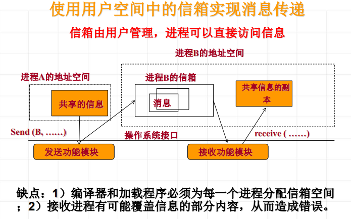
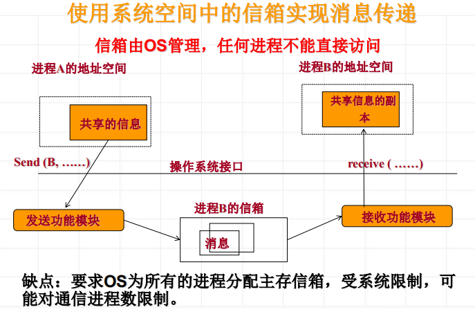

<!--
 * @Descripttion: 
 * @version: 
 * @Author: WangQing
 * @email: 2749374330@qq.com
 * @Date: 2020-01-01 22:29:48
 * @LastEditors  : WangQing
 * @LastEditTime : 2020-01-01 22:36:35
 -->
# 进程通信

进程通信(Interprocess Communication, IPC)是指进程之间直接以较高的效率传递较多数据的信息交互方式

## 消息缓冲通信

- 在消息通信中，接收方和发送方之间有明确的协议和消息格式
- 消息缓冲通信方式包括消息缓冲、发送原语和接收原语

##  信箱通信

- 在信箱通信中，需要定义信箱结构，还包括消息发送和接收功能模块，提供发送原语和接收原语
- 信箱通信中，所使用的信箱可以位于用户空间中，是接收进程地址空间的一部分；也可以放置在操作系统的空间中

