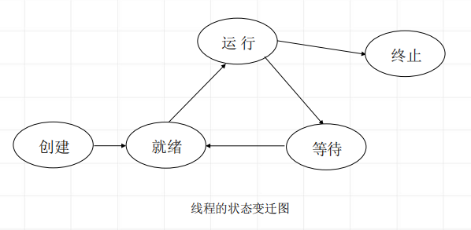

<!--
 * @Descripttion: 
 * @version: 
 * @Author: WangQing
 * @email: 2749374330@qq.com
 * @Date: 2020-01-01 22:37:02
 * @LastEditors: WangQing
 * @LastEditTime: 2020-01-01 22:40:26
 -->
# 线程概念及特点

**线程是比进程更小的活动单位，它是进程中的一个执行路径**

- 进程中的一条执行路径
- 它有自己私用的堆栈和处理机执行环境
- 它与父进程共享分配给父进程的主存
- 它是单个进程所创建的许多个同时存在的线程中的一个

**特点**
- 线程是比进程更小的活动单位，它是进程中的一个执行路径。创建一个线程比创建一个进程开销要小得多。
- 实现线程间通信十分方便，因为一个进程创建的多个线程
- 可以共享地址区域和数据。
- 线程是一个动态的概念。
- 在进程内创建多线程，可以提高系统的并行处理能力，
- 加快进程的处理速度。

