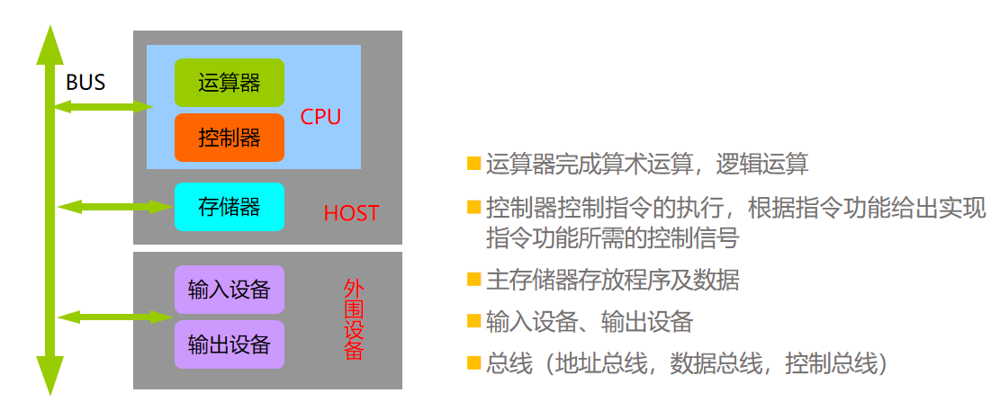

<!--
 * @Descripttion: 
 * @version: 
 * @Author: WangQing
 * @email: 2749374330@qq.com
 * @Date: 2019-12-23 12:36:27
 * @LastEditors: WangQing
 * @LastEditTime: 2019-12-23 12:49:21
 -->
# 计算机系统结构

## 冯诺依曼思想

存储程序、程序控制

> 存储程序：将程序存放在计算机的存储器中
> 程序控制：按指令地址访问存储器并取出指令，经译码依次产生指令执行所需的控制信号，实现对计算的控制，完成指令的功能

## 计算机软件系统

- 计算机硬件是载体，软件是灵魂
- 软件：一切程序的集合，可运行的思想和内容的数字化
- 固件：具有软件功能，具有硬件形态的部件

- 系统软件
    - 操作系统
    - 语言处理程序
    - 标准程序库
    - 服务性程序
    - 数据库管理系统
    - 计算机网络软件