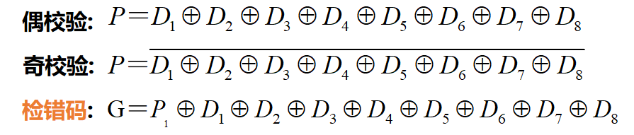
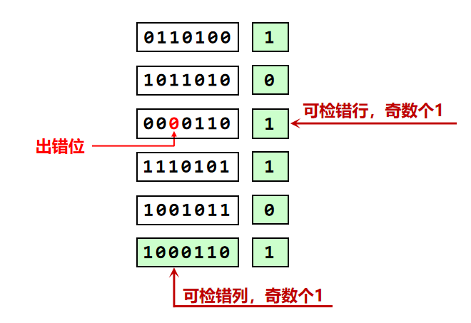

<!--
 * @Descripttion: 
 * @version: 
 * @Author: WangQing
 * @email: 2749374330@qq.com
 * @Date: 2019-12-23 17:48:41
 * @LastEditors: WangQing
 * @LastEditTime: 2019-12-23 18:16:28
 -->
# 数据信息校验

## 奇偶校验

识别奇数错，不能纠错，不保证正确，实现简单，编码效率高

**二维奇偶校验**

## 海明校验

- 编码规则：分组交叉奇偶校验法
    - 待编码数据分成 r 个奇偶校验组，r>1
    - r 位校验位（冗余），生成r位检错码
    - 各数据位至少参加2个校验组
    - 一个数据位出错，可导致多个检错码为1
- 检错纠错：检错码值表示出错位置   （假设1位错）
    - 检错码全零， 数据大概率正常
    - 可检错，也可纠错，将出错位取反即可

## CRC

- 编码规则：编码可被生成多项式整除
- 模2除法，余数为0（高概率正确），否则出错
- 设CRC码 N 位，其中数据位 k 位，校验位 r 位（冗余位）
- 可检错，可纠错