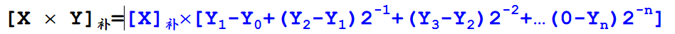

<!--
 * @Descripttion: 
 * @version: 
 * @Author: WangQing
 * @email: 2749374330@qq.com
 * @Date: 2019-12-24 15:33:33
 * @LastEditors: WangQing
 * @LastEditTime: 2019-12-24 16:27:09
 -->
# 定点乘法运算

## 原码乘法

符号位等于异或运算，其他位绝对值相乘

**与门**实现

## 补码乘法

