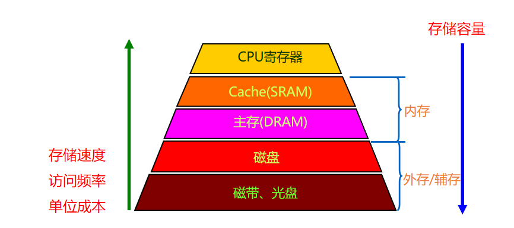

<!--
 * @Descripttion: 
 * @version: 
 * @Author: WangQing
 * @email: 2749374330@qq.com
 * @Date: 2019-12-24 16:29:43
 * @LastEditors  : WangQing
 * @LastEditTime : 2019-12-24 16:36:51
 -->
# 主存器概述

## 分类

### 按存储介质

- 半导体存储器
    - 双极型存储 MOS存储器  
    - 速度快、功耗低
- 磁存储器
    - 磁芯、磁带、磁盘   
    - 容量大，速度慢、体积大
- 激光存储器
    - CD-ROM  CD-RW  CD-R  
    - DVD-ROM  DVD-RW  DVD-R
    - 便于携带，廉价，易于保存

### 按存储方式

- 随机存储器
    - 存取时间与物理位置无关
    - 磁芯、半导体存储器
- 顺序存储器
    - 存取时间与物理位置有关
    - 磁盘、磁带、激光存储器

## 按读写功能

- 只读存储器 (ROM)
    - 存储器内容是预置的，固定的，无法改写
- 读/写存储器
    - 既能读出也能写入的存储器
    - 随机存储器RAM

## 按信息的可保存性

- 易失性存储器 Volatile Memories
    - 断电后信息消失
    - SRAM
    - DRAM
- 非易失性存储器Non-Volatile Memories
    - 断电后仍能保存信息
    - 磁存储器、激光存储器、NVRAM

## 按在计算机系统中的作用

- 主存储器
- 辅助存储器
- 高速缓冲存储器  Cache
- 控制存储器

## 存储系统分层结构

