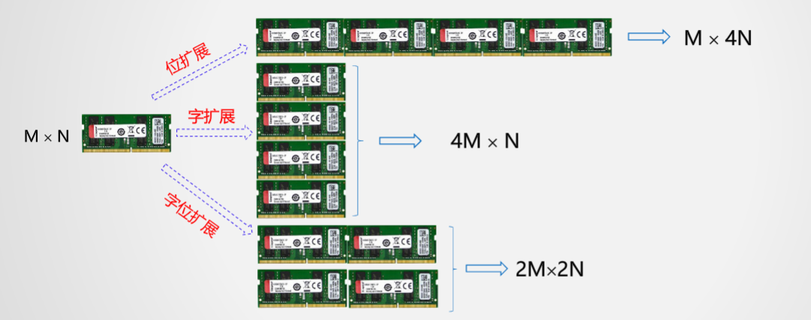
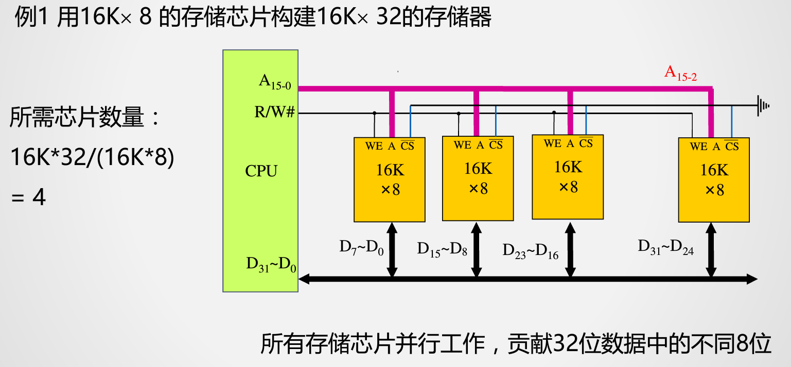
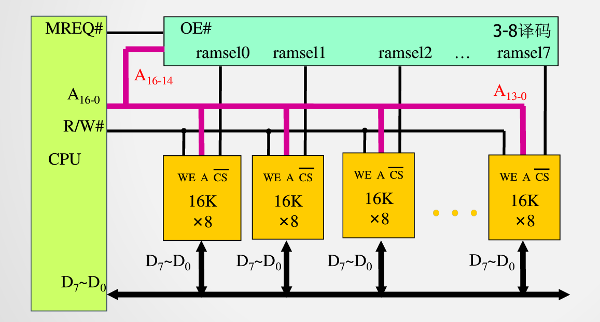
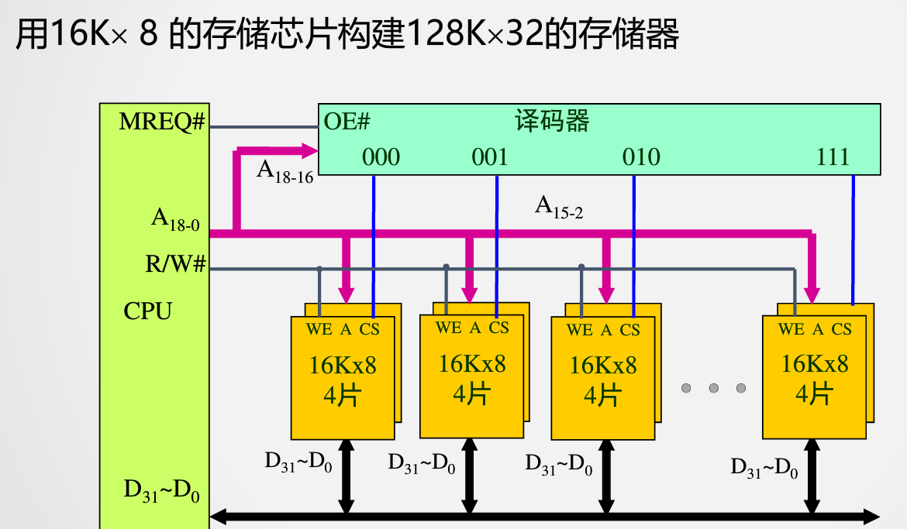

<!--
 * @Descripttion: 
 * @version: 
 * @Author: WangQing
 * @email: 2749374330@qq.com
 * @Date: 2019-12-24 17:20:26
 * @LastEditors: WangQing
 * @LastEditTime: 2019-12-24 17:48:45
 -->
# 存储扩展

**无论哪种类型的存储扩展都要完成CPU与主存间的地址线、数据线、控制线的连接**

## 位扩展

## 字扩展

## 字位同时扩展

