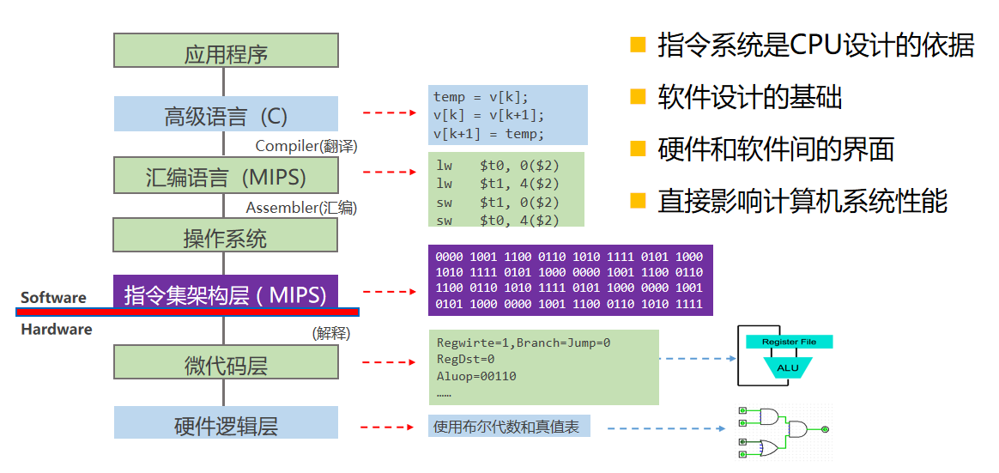

<!--
 * @Descripttion: 
 * @version: 
 * @Author: WangQing
 * @email: 2749374330@qq.com
 * @Date: 2019-12-25 14:33:11
 * @LastEditors  : WangQing
 * @LastEditTime : 2019-12-25 14:39:06
 -->
# 指令系统概述

## 基本概念

- 机器指令（指令）
    - 计算机能直接识别、执行的某种操作命令
- 指令系统（指令集）
    - 一台计算机中所有机器指令的集合
- 系列机
    - 基本指令系统相同，基本系统结构相同的计算机
    - 解决软件兼容的问题
- 完备性
    - 指令丰富，功能齐全，使用方便
- 有效性
    - 程序占空间小，执行速度快
- 规整性
    - 对称性
    - 均齐性
    - 一致性
- 兼容性
    - 系列机软件向上兼容

## 指令系统层次

