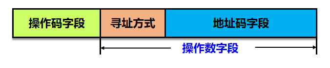

<!--
 * @Descripttion: 
 * @version: 
 * @Author: WangQing
 * @email: 2749374330@qq.com
 * @Date: 2019-12-25 14:39:30
 * @LastEditors: WangQing
 * @LastEditTime: 2019-12-25 14:48:56
 -->
# 指令格式

表示一条指令的机器字，称之为**指令字**，简称**指令**

**指令格式**用二进制表示指令的结构形式

