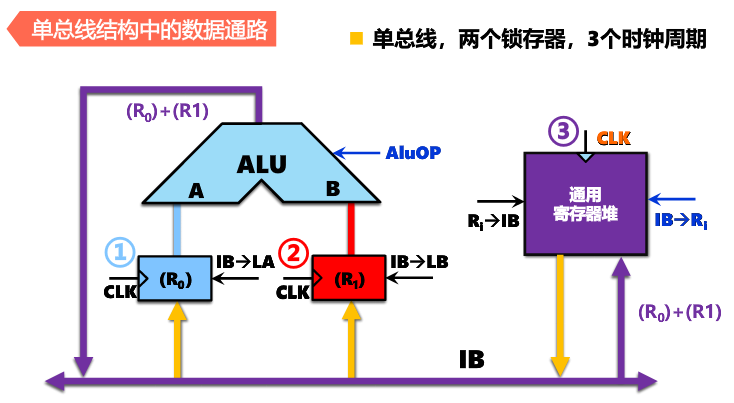
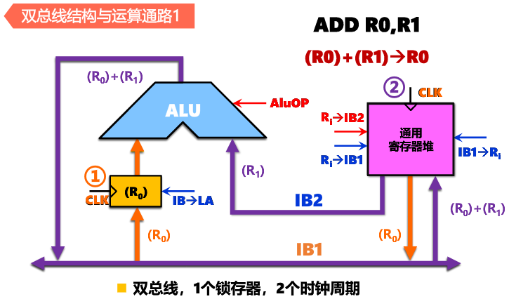
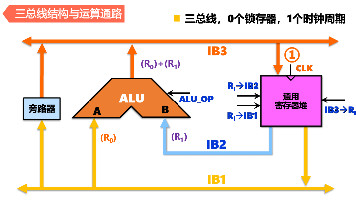
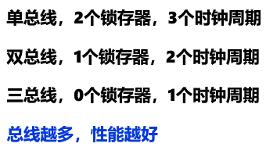

<!--
 * @Descripttion: 
 * @version: 
 * @Author: WangQing
 * @email: 2749374330@qq.com
 * @Date: 2019-12-25 16:33:59
 * @LastEditors: WangQing
 * @LastEditTime: 2019-12-25 16:47:55
 -->
# 数据通路

执行部件间传送信息的路径

通路的建立由控制信号控制，受时钟驱动

