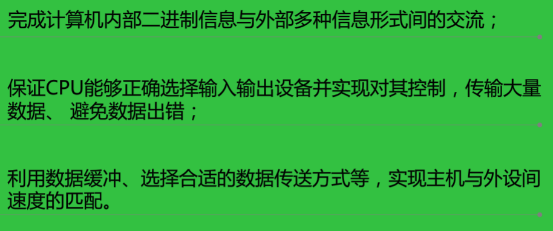
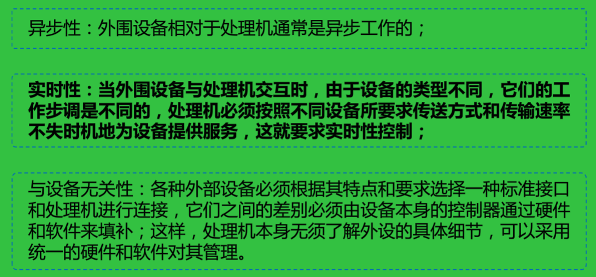
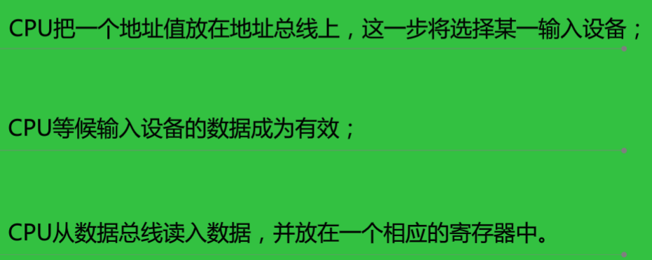
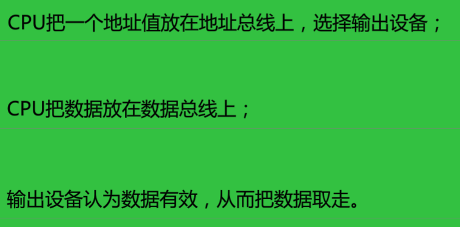
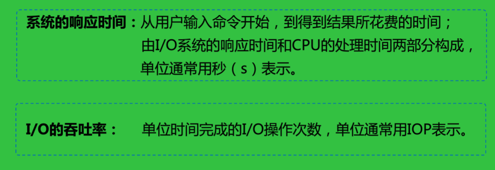

<!--
 * @Descripttion: 
 * @version: 
 * @Author: WangQing
 * @email: 2749374330@qq.com
 * @Date: 2019-12-26 18:02:51
 * @LastEditors  : WangQing
 * @LastEditTime : 2019-12-26 18:20:34
 -->
# 输入输出系统概述

外部设备、接口部件、总线以及相应的管理软件统称为计算机的输入/输出系统，简称**I/O系统**

## 功能

## 特点

## 同CPU交换数据的过程

- 输入过程

- 输出过程

### 性能

